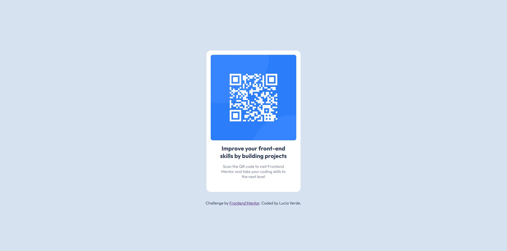

# Frontend Mentor - QR code component solution

This is a solution to the [QR code component challenge on Frontend Mentor](https://www.frontendmentor.io/challenges/qr-code-component-iux_sIO_H). 

## Table of contents

- [Overview](#overview)
  - [Screenshot](#screenshot)
  - [Links](#links)
- [My process](#my-process)
  - [Built with](#built-with)
  - [What I learned](#what-i-learned)
- [Author](#author)

## Overview

### Screenshot

#### Desktop version screenshot

#### Mobile version screenshot

### Links

- Solution URL: [Add solution URL here](https://github.com/LuciaVerde/Frontend-Mentor-QR-code-solution)
- Live Site URL: [QR code solution](https://frontendmentorqrcodesolution.netlify.app/)

## My process
1.Set up
2.HTML
3.Sass

### Built with

- Semantic HTML5 markup
- CSS custom properties
- CSS Grid
- Desktop-first workflow
- Sass

### What I learned

Through this project you could refresh some basic concepts that I had somewhat forgotten.

## Author

- Frontend Mentor - [@LuciaVerde](https://www.frontendmentor.io/profile/LuciaVerde)
- GitHub - [Lucia Verde](https://github.com/LuciaVerde)
- LinkedIn - [Lucia Verde](https://www.linkedin.com/in/lucia-verde-6bb9822b1/)
